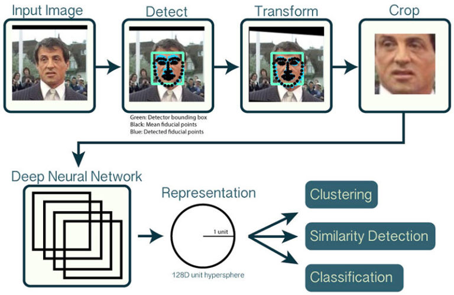
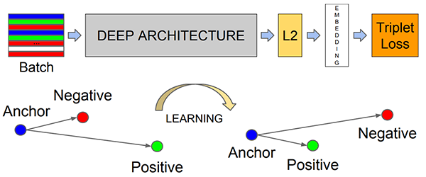

# TG-hackathon-1
# Outputs of webcam stream
## output1
 

   
  

  
## output2
 

   
  

## sample dataset for known(Manikantha)
 

   
  

  
## sample dataset for unknown
 

   
  

# Theory
To build our face recognition system, we’ll first perform face detection, extract face embeddings from each face using deep learning, train a face recognition model on the embeddings, and then finally recognize faces in both images and video streams with OpenCV.

1.Detect faces

2.Compute 128-d face embeddings to quantify a face

3.Train a Support Vector Machine (SVM) on top of the embeddings

4.Recognize faces in images and video streams

All of these tasks will be accomplished with OpenCV, enabling us to obtain a “pure” OpenCV face recognition pipeline.

# How OpenCV face-recogninition works

   
  

   
  

  
 To train a face recognition model with deep learning, each input batch of data includes three images:

The anchor

The positive image

The negative image

The anchor is our current face and has identity Manikantha.

The second image is our positive image — this image also contains a face of person Manikantha.

The negative image, on the other hand, does not have the same identity, and could belong to any other unknown person.

The point is that the anchor and positive image both belong to the same person/face while the negative image does not contain the same face.

The neural network computes the 128-d embeddings for each face and then tweaks the weights of the network (via the triplet loss function) such that:

The 128-d embeddings of the anchor and positive image lie closer together
While at the same time, pushing the embeddings for the negative image father away
In this manner, the network is able to learn to quantify faces and return highly robust and discriminating embeddings suitable for face recognition.
