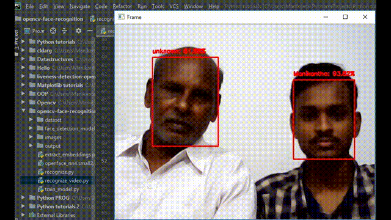

# TG-hackathon-1
# Outputs of webcam stream
## output1
 

   
  

  
## output2
 

   
  

## sample dataset for known(Manikantha)
 

   
  

  
## sample dataset for unknown
 

   
  

# Theory
To build our face recognition system, we’ll first perform face detection, extract face embeddings from each face using deep learning, train a face recognition model on the embeddings, and then finally recognize faces in both images and video streams with OpenCV.

1.Detect faces
2.Compute 128-d face embeddings to quantify a face
3.Train a Support Vector Machine (SVM) on top of the embeddings
4.Recognize faces in images and video streams
All of these tasks will be accomplished with OpenCV, enabling us to obtain a “pure” OpenCV face recognition pipeline.

## 1.4 Object detection workflow

Object detection workflow has the following steps :

1.Preparation of dataset.

2.Annotating the dataset.

3.Training the model on dataset and performing evaluation.

4.Testing the model on new unseen data.
